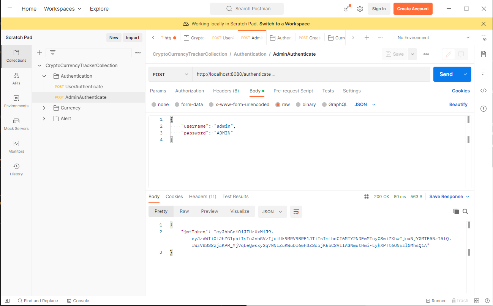
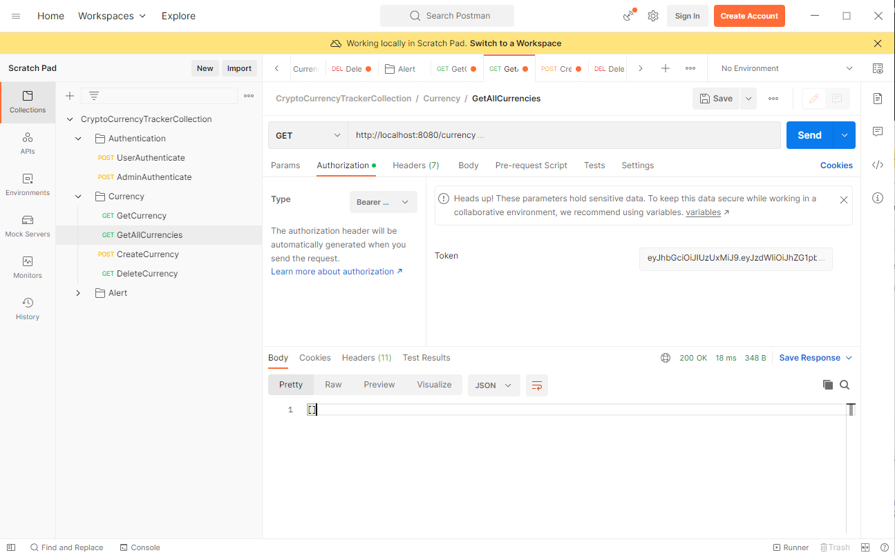
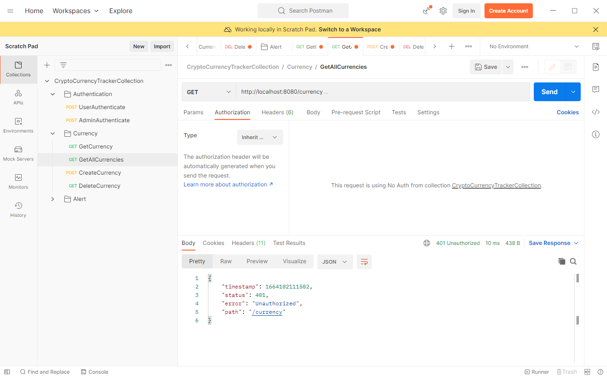
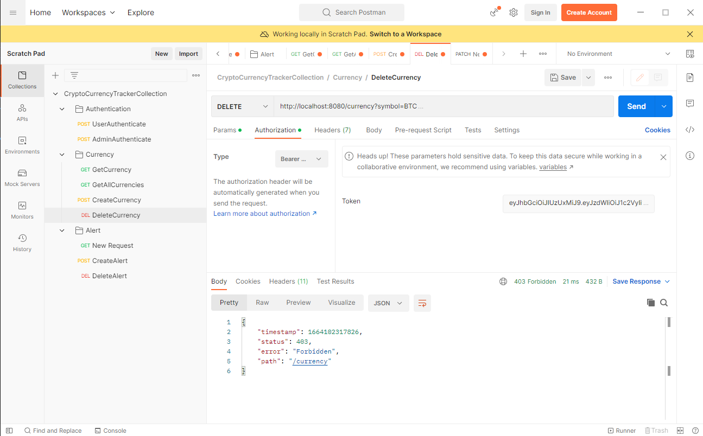
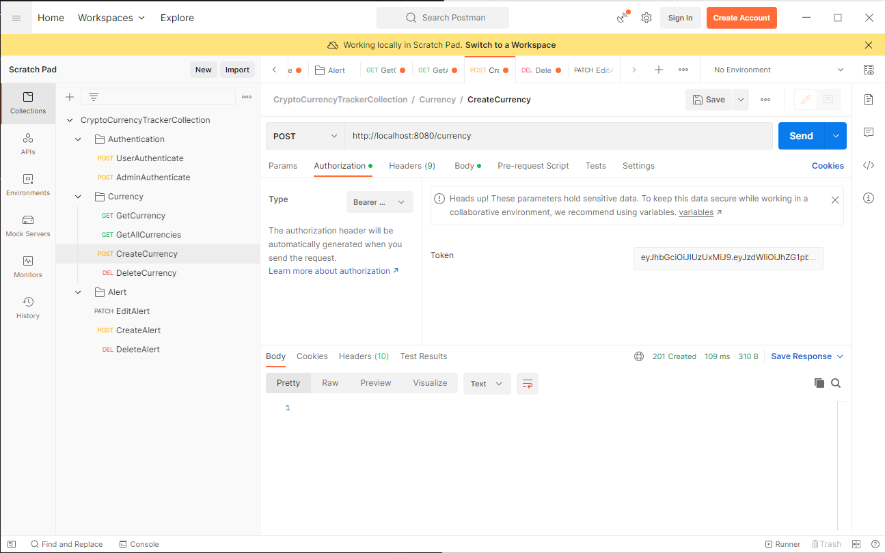
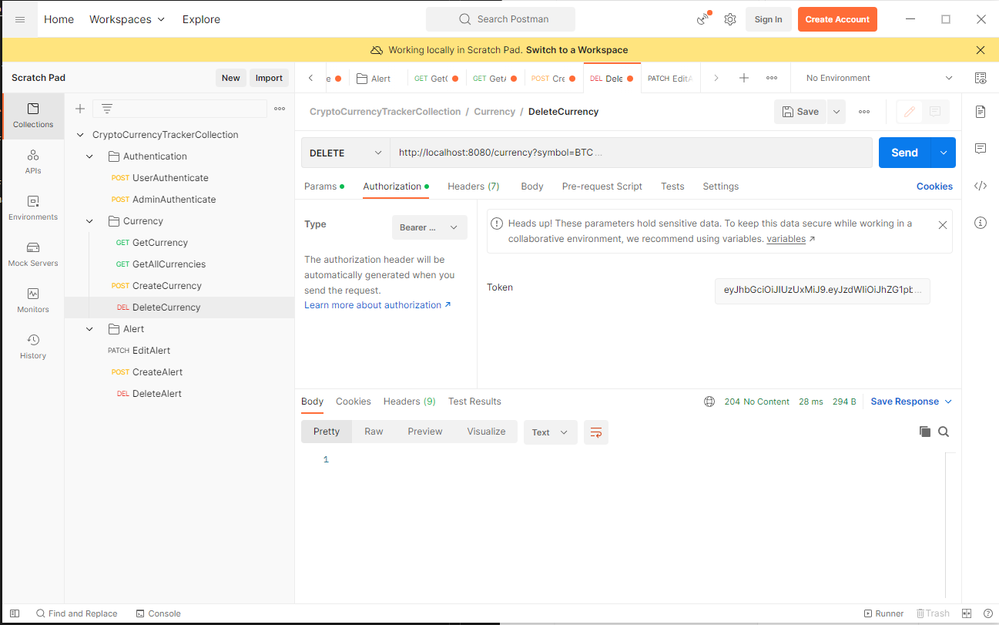
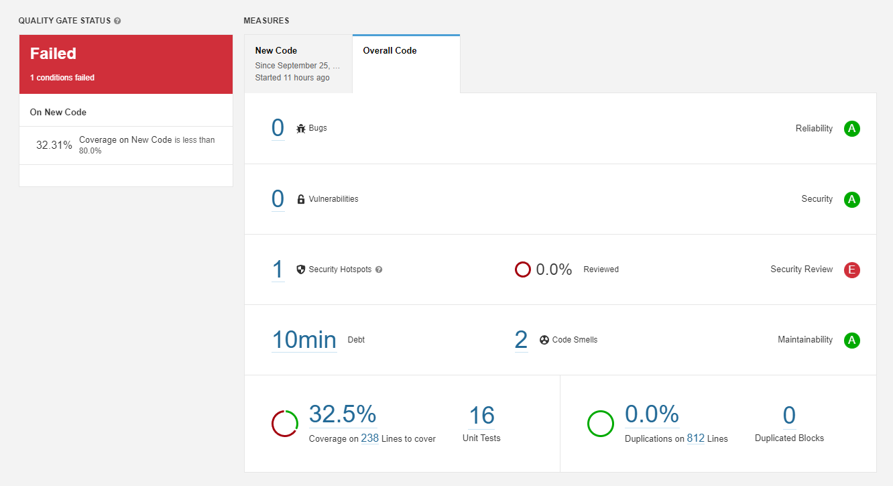

## Running the application

*Tested on Windows 10*

1. Compile to create an executable jar: 

       $ mvn clean install

2. Run application with docker-compose:

   1. Run docker-compose build to build the container.

         $ docker-compose build

   2. Then call docker-compose up to run the MySQL database and the application. 
    
         $ docker-compose up

The app must be run on port 8080 and the MySQL database must be run on port 3306.
 
Navigate http://localhost:8080/swagger-ui/index.html#/ to open swagger documentation.

## Testing the application
I added the `CryptoCurrencyTracker.postman_collection.json` in the root directory of this project. This collection contains all of the requests a user can make. To test currency and alert requests first the user have to authenticate themselves via `/authenticate` request.

There are 2 user records in the MySQL database. Users are inserted to the database on the startup with initial sql script.
Their usernames, passwords, and roles are; 
    
| index | Username | Password | Role  |
| ----- | -------- | -------- | ----- |
|  1    | admin    | ADMIN    | ADMIN |
|  2    | user     | USER     | USER  |

 

The user can access all functionality related to currencies with `/currency` endpoint.

All users can can access the `GET` methods but only users that are `ADMIN` can access the `DELETE` and `POST` methods.

 

The user can access all functionality related to alerts with `/alert` endpoint.

All users can access all the functionality `/alert` is offering.

 

After authentication application returns a jwtToken response.

 

The user needs to enter the token like in the screenshot below.

 

Otherwise application will response with `401 Unauthorized` status.

 

If a user with the role `USER` tries to access `DELETE` or `POST` methods of the currency, application will response with `403 Forbidden`.

If a user with the role `ADMIN` tries to access `DELETE` or `POST` methods of the currency, application will response with either `201 Created` or `204 No Content`

 

`201 Created`

`204 No Content`

When you add alerts and currencies to database, alerts will log frequently if they reached the target price.
The alerts reached to target price will be updated to `triggered` state automatically by application.
So actually the application only logs the alerts that have `triggered` stage.

When you try to update an alert the application behaves in two possible ways. 

If an alert's status is `NEW`, application updates its status to `CANCELLED`. 

If an alert's status is `TRIGGERED`, application updates its status to `ACKED`. 

 

## Sonar Results:
